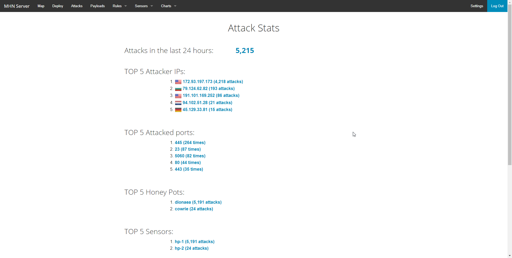
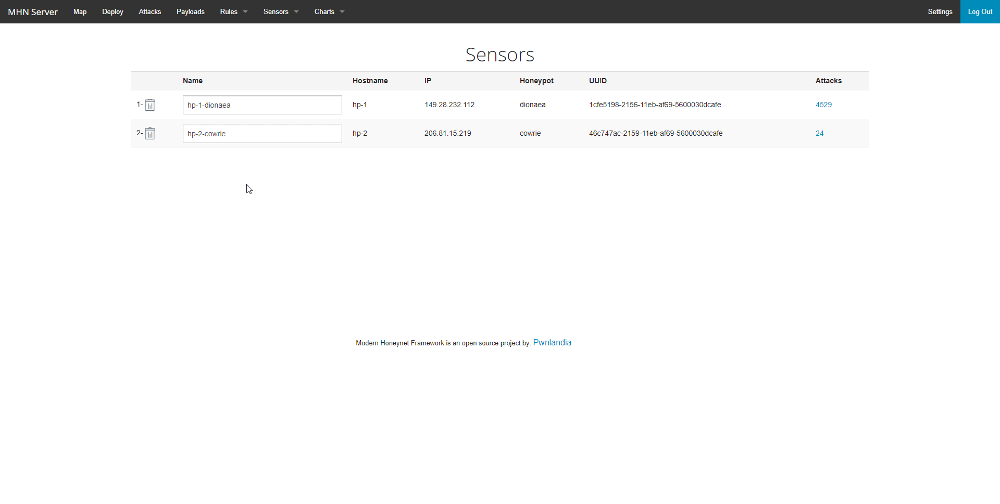
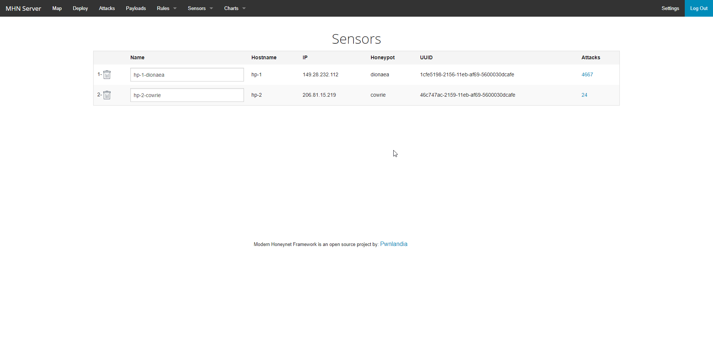
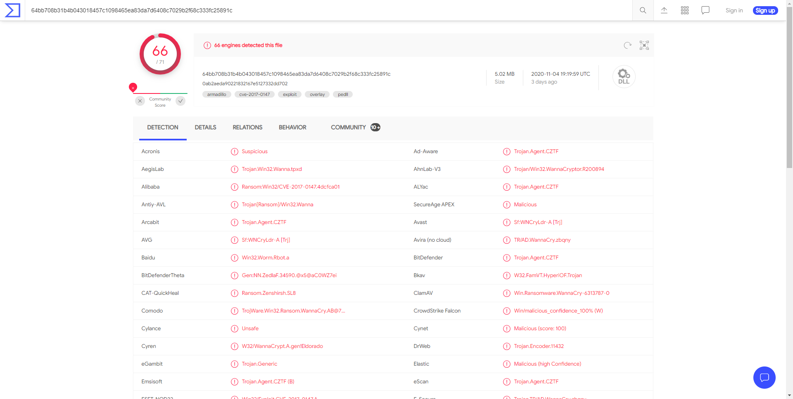

# Honeypot Assignment

**Time spent:** **4** hours spent in total

**Objective:** Create a honeynet using MHN-Admin. Present your findings as if you were requested to give a brief report of the current state of Internet security. Assume that your audience is a current employer who is questioning why the company should allocate anymore resources to the IT security team.

### MHN-Admin Deployment (Required)

**Summary:** I deployed MHN-Admin onto a Vultr cloud computing VPS. I was running Ubuntu 18.04 LTS on it.

### Dionaea Honeypot Deployment (Required)

**Summary:** Dionaea is a honeypot designed to capture malware submitted to the server in an attempted exploit. I put my Dionaea honeypot on another Vultr VPS.

### Database Backup (Required) 

**Summary:** It would appear that MHN-Admin uses MongoDB, which is a non-relational database. The exported information is a list of attacks including the source IP, the honeypot that it was attacking, the ports, the time, and a unique identifier.

[session.json](session.json)

### Deploying Additional Honeypot(s) (Optional)

#### Cowrie Honeypot

**Summary:** Cowrie is a medium to high interaction SSH/telnet honeypot that is used to monitor how attackers are brute forcing ssh, and if they are able to get access, it monitors what they try to do.

### Malware Capture and Identification (Optional)

#### X Malware

**Summary:** Dionaea had a ton of malware submissions in a short time. I will go over one here. I got the hash from the Payloads portion of the MHN-Admin site.

MD5 Hash: 0ab2aeda90221832167e5127332dd702

SHA1 Hash: f370045d8ac3f4ba78acf8bfe4c4d35758d5ea05

It is WannaCry, which is a trojan ransomware that encrypts your files and requests payment in Bitcoin to unlock them.

[Link to VirusTotal](https://www.virustotal.com/gui/file/64bb708b31b4b043018457c1098465ea83da7d6408c7029b2f68c333fc25891c/detection)

